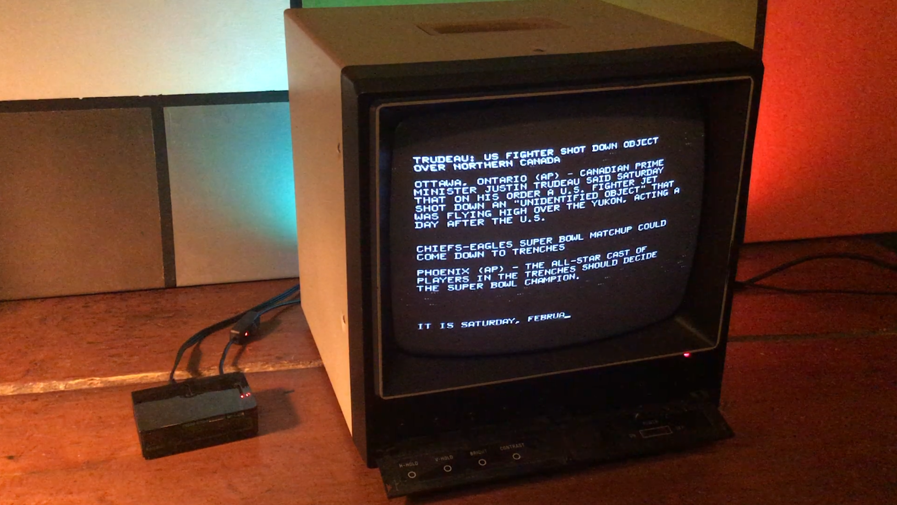

# RetroFeed

Use a Raspberry Pi to display weather, news, and other information, on a composite monitor... vintage style!

The feed is a continuous scroll up the screen, using plain ASCII text at 40x24 (this is configurable), along the lines of Don Lancaster's [TV Typewriter](https://en.wikipedia.org/wiki/TV_Typewriter) and similar displays of its era.
  
There are two main parts to the RetroFeed project. The fun is in combining them, but they'll work independently too:

1. A set of Python scripts that fetch/process data from the web and send it out to the standard console. You can actually run this on any Python-supporting computer, from your usual terminal window, using any sort of display. It might not look as cool, but it's still kind of neat to watch the info scroll by.
2. Instructions (see [config.md](https://github.com/JeffJetton/retrofeed/blob/main/config.md)) for setting up your Pi for composite output and configuring the default Pi terminal to appear full-screen and approrpiately "retro". This can also be done on its own, without running RetroFeed, for an old-school command-line experience.

Currently the scripts are just doing some clumsy web-scraping, with refreshes at certain intervals. Expect the scrapers to break at some point, if they're not already broken by the time you read this. One could also use RSS feeds and/or publicly-available APIs, of course, but this avoids having to sign up for a bunch of accounts and API keys.

### Contribution Policy

My intention with RetroFeed was just to make simple, personal hobby project and then move on to other things. Due to time contraints, I originally was not accepting external contributions.

Since then I've rewritten how RetroFeed handles the "segments" it displays, making them more like modular plug-ins. **I welcome and encourage the creation of new segments** but ask that they be hosted and maintained on your own repository.

Let me know if you make a cool segment! I'll add links here to my favorites. :-)

