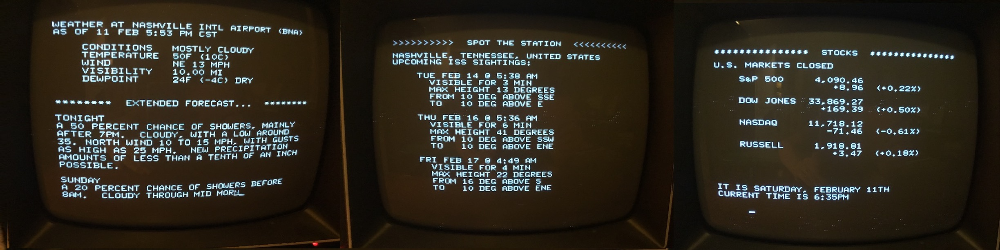

# RetroFeed

Use a Raspberry Pi to display weather, news, and other information, on a composite monitor... vintage style!

The feed is a continuous scroll up the screen, using plain ASCII text at 40x24, along the lines of Don Lancaster's [TV Typewriter](https://en.wikipedia.org/wiki/TV_Typewriter) and similar displays of its era.

See [config.md](https://github.com/JeffJetton/retrofeed/blob/main/config.md) for tips on setting up your Pi for composite output, getting it to boot to the command line, configuring the default Pi terminal to look appropriately "retro", etc.

Currently this is just doing some very clumsy web-scraping, with refreshes at certain intervals. Expect the scrapers to break at some point, if they're not already broken by the time you read this. One could also use RSS feeds and/or publicly-available APIs, of course.

### Contribution Policy

My intention with RetroFeed was just to make simple, personal hobby project and then move on to other things. So while it is Open Source, it is not currently open to contributions. Feel free to fork this repo and go nuts though!

